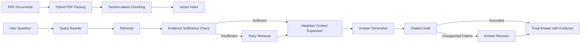

# Corpus-aware Agentic RAG with LlamaIndex

This project is a corpus-aware Agentic RAG system built with LlamaIndex. It started from a thesis QA task, but the current version is designed as a more general framework for document-grounded question answering, claim verification, and citation-aware response generation.

The core goal is not just to retrieve chunks and answer questions. The system tries to check whether the retrieved evidence is sufficient, retry retrieval when needed, expand neighboring context, generate grounded answers, audit citation support, and revise answers that are not sufficiently supported.

## System Pipeline




## 1. Project Overview

Traditional RAG systems often follow a simple pipeline:

```text
question -> retrieval -> answer
```

This project implements a stronger Agentic RAG workflow:

```text
question
-> corpus-aware query rewrite
-> retrieval
-> evidence sufficiency check
-> retry retrieval if evidence is weak
-> neighbor context expansion
-> grounded answer generation
-> citation audit
-> answer revision
-> evaluation
```

The current demo corpus is a thesis on student-oriented Chain-of-Thought optimization. The framework is designed to be extended to other papers or reports by replacing the corpus profile and rebuilding the index.

## 2. Main Features

### Corpus-aware query rewriting

The system uses `configs/corpus_profile.yaml` to provide corpus-level context such as title, domain, key topics, entity types, and section rules. Query rewriting uses this profile as optional context instead of hardcoding thesis-specific keywords in Python code.

### Generic multi-document indexing

The indexing pipeline supports document-level metadata such as:

```text
doc_id
paper_id
title
authors
year
source
file_name
page
section_type
section_title
chunk_id
previous_chunk_id
next_chunk_id
```

The chunking strategy is:

```text
generic multi-doc + auto section + paragraph-first + table/figure-safe + sentence-safe split
```

### Evidence sufficiency check

After retrieval, the Agentic RAG pipeline checks whether the retrieved evidence is enough to answer the question. If evidence is weak, it can retry retrieval with a rewritten query.

### Neighbor context expansion

The index stores neighboring chunk IDs, so the system can expand local context around retrieved chunks. This helps when the answer is split across adjacent chunks.

### Citation audit and answer revision

The system audits whether the generated answer is supported by the retrieved sources. If the answer contains weak or unsupported claims, the system can revise it into a more cautious and grounded response.

### Online-style and offline-style evaluation

The project separates two evaluation modes:

```text
Online-style judge:
Only sees question, answer, and retrieved sources.
This simulates real user queries.

Offline benchmark judge:
Can optionally use gold hints such as expected pages, expected sections, and answer keywords.
This is only for debugging and benchmark analysis.
```

By default, the hard Agentic RAG evaluation uses online-style judging.

## 3. Project Structure

```text
rag_agent_harness/
  configs/
    baseline.yaml
    corpus_profile.yaml

  data/
    parsed/
      thesis_clean_pages.jsonl
    eval/
      eval_set.jsonl
      eval_set_hard.jsonl

  storage/
    thesis_index/

  src/
    indexing/
      build_index.py
    rag/
      query_thesis.py
    agentic/
      agentic_rag.py
    eval/
      evaluate_retrieval.py
      evaluate_agentic_rag.py
      agentic_judge.py

  outputs/
    agentic_rag/
    agentic_rag_hard_generic/
```

## 4. Setup

Install dependencies in your virtual environment. A typical setup is:

```powershell
pip install llama-index llama-index-llms-openai llama-index-embeddings-openai python-dotenv pyyaml
```

Set your OpenAI API key:

```powershell
$env:OPENAI_API_KEY="your_api_key_here"
```

Or put it in a `.env` file:

```text
OPENAI_API_KEY=your_api_key_here
```

## 5. Build the Index

Run:

```powershell
python src\indexing\build_index.py --reset
```

Expected output should include a real document title instead of `unknown_source`, for example:

```text
Document counts:
- doc_data_parsed_thesis_clean_pages_jsonl_stu_de84f34eaeac: 293 chunks | title=Student-Oriented Chain-of-Thought Optimization
```

## 6. Run Retrieval Evaluation

```powershell
python src\eval\evaluate_retrieval.py `
  --eval_file data\eval\eval_set.jsonl `
  --output_dir outputs\agentic_rag
```

Current retrieval snapshot:

```text
page_hit@8       = 0.9583
section_hit@8    = 0.8333
keyword_recall@8 = 0.7368
```

## 7. Run Hard Agentic RAG Evaluation

```powershell
python src\eval\evaluate_agentic_rag.py `
  --eval_file data\eval\eval_set_hard.jsonl `
  --output_dir outputs\agentic_rag_hard_generic `
  --run_name agentic_rag_hard_generic_v3
```

Current hard evaluation snapshot:

```text
avg_overall_score                     = 4.8667 / 5
advanced_judge.avg_overall_score       = 4.8667 / 5
advanced_judge.total_critical_mismatch = 0
verdict_counts                         = 14 excellent, 1 partial
```

## 8. Run Interactive Query Demo

Example:

```powershell
python src\rag\query_thesis.py "Does the thesis prove that local CoT repair works for all LLMs and all reasoning benchmarks?"
```

Expected behavior:

```text
The system should not overclaim. It should state that the retrieved sources do not prove universal generalization to all LLMs and all reasoning benchmarks.
```

To show the rewritten retrieval query:

```powershell
python src\rag\query_thesis.py "What is the Teacher-Student-Controller framework?" --show_rewritten_query
```

## 9. Demo Queries

### Demo 1: Method understanding

```powershell
python src\rag\query_thesis.py "What is the Teacher-Student-Controller framework?"
```

This shows that the system can retrieve and explain the method design.

### Demo 2: Cross-section reasoning

```powershell
python src\rag\query_thesis.py "How is the Teacher-Student-Controller framework connected to the final math500 strict improvements?"
```

This shows that the system can connect method evidence with results evidence.

### Demo 3: Unsupported claim control

```powershell
python src\rag\query_thesis.py "Does the thesis prove that local CoT repair works for all LLMs and all reasoning benchmarks?"
```

This shows that the system can avoid hallucinating an unsupported universal claim.

## 10. Why This Is More Than Basic RAG

A basic RAG system retrieves chunks and generates an answer. This project adds several control layers:

```text
query rewriting
retrieval retry
evidence sufficiency check
neighbor context expansion
citation audit
answer revision
unsupported claim handling
hard claim-verification evaluation
```

These components make the system more reliable for document-grounded QA and claim verification tasks.

## 11. Limitations

Current limitations:

1. The current demo corpus is still mainly one thesis document.
2. Chunking is sometimes too fine-grained, producing many short heading chunks.
3. Some unsupported-claim questions may still require stronger refusal wording.
4. Multi-paper indexing is supported at the metadata level, but larger multi-paper testing is still future work.

## 12. Future Work

Planned improvements:

1. Add multi-paper benchmark tests.
2. Merge very short heading-only chunks into nearby paragraph chunks.
3. Add a lightweight web or Streamlit demo UI.
4. Add automatic corpus profile generation from uploaded documents.
5. Add more fine-grained claim-level citation visualization.
